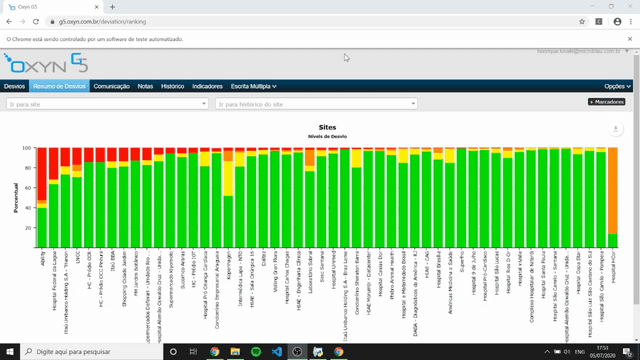

<h1>
Automating Work Process
</h1>

    
    

 
&nbsp;&nbsp;&nbsp;&nbsp;&nbsp;&nbsp;Using Python, I created this program capable of setup some webpages by itself. It helps me saving 15 minutes of my daily routine at work.

## Summary :pushpin:
- Frameworks
- Requiriments
- Installation Guide
- Links
- Run Application

## Frameworks :computer: 
&nbsp;&nbsp;&nbsp;&nbsp;&nbsp;&nbsp;To be succeeded in this project I had to use some Python frameworks, like:
- Datetime
  - Timedelta
- Pyautogui
- Selenium
  - ActionChains
  - Expected_Conditions
  - Webdriver
  - WebDriverWait
- Time
- OS

##### &nbsp;&nbsp;&nbsp;&nbsp;&nbsp;&nbsp;Observation: Don't worry about instalation, because it's going to be presented in the following topics.

## Requiriments :memo:
&nbsp;&nbsp;&nbsp;&nbsp;&nbsp;&nbsp;To run the program is important to have these programs and frameworks installed in your machine.
#### Program
- [Python 3.8.3](https://www.python.org/downloads/)
#### Framework
- [Datetime](https://docs.python.org/3/library/datetime.html#)
- [Pyautogui](https://pyautogui.readthedocs.io/en/latest/install.html)
- [Selenium](https://selenium-python.readthedocs.io/installation.html)

## Instalation Guide :book:

## Links :link:
## Run Application :arrow_forward: 

    

